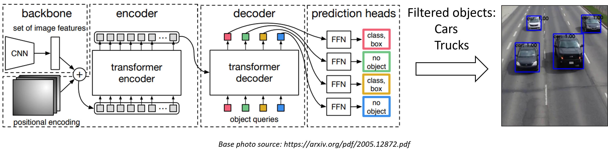

# Computer Vision Tools to Extract Traffic Data from Cameras.
## Introduction
This repository contains codes for the implementation of DETR (Facebook's Detection Transformer) and SORT (Simple Online and Realtime Tracking) algorithms in PyTorch with the goal of detecting and tracking vehicles in surveillance video cameras. 
A brief introduction to DETR and SORT can be found at (https://arxiv.org/abs/1602.00763) and (https://arxiv.org/abs/2005.12872).

## The overall architecture

# Installation
Several packages are required to make the whole code work as follow.The deployment is designed to run on regular CPU with real-time speed. 
### Supporting packages
- `Labelme` was a tool to design the study zones, i.e., where to count. Save the zone definition in a json file and pass its path to the main.py code. 
- USe https://www.robots.ox.ac.uk/~vgg/software/via/via.html for defining the study zones instead. Labelme is not working with some Windows 10/11 updates. 
- `DETR and SORT` This tool is selected due to the big size of the cars exiting the garage. DETR is suitable for these irregularly large object compared to YOLO seires. 
- `P2PNET and SORT`. There is servere occlusion in the pedestrain videos, therefore we use a point based head detector and point based tracker to count the pedestrains. 

## How to use
1. Install lableme `pip install labelme` and load one screen shot of the camera and defined the study zones. 
2. git clone detr, p2pnet, and SORT.
      `git clone https://github.com/facebookresearch/detr.git`    
      `git clone https://github.com/TencentYoutuResearch/CrowdCounting-P2PNet.git`    
      `git clone https://github.com/adipandas/multi-object-tracker`    
3. Add the directories above to the python sys in `mian.py`.
4. pass the video path to `main.py` for now. Later the signal will be live feed. 

## How the model works:
The code loads the DETR model pre-trained on the COCO dataset using PyTorch's `torch.hub.load function`. The model is moved to the selected device (GPU or CPU) and set to evaluation mode.

1. The code reads a video file using OpenCV's VideoCapture and extracts its width, height, FPS, and other information.
2. It initializes the SORT tracker (`tracker = SORT()`).
3. It enters a loop where it processes each frame of the video, and performs object detection using the predict function, which uses the DETR model to generate bounding box predictions, confidences, and class labels for objects in the frame, and passes the detection results to the SORT tracker to perform object tracking, records tracking information (centroid coordinates and frame number) for each tracked object in the data dictionary.
4. It saves the results and also displays them on video frames (e.g., detected bounding boxes with their corresponding confidence level, and object IDs).

## Visualized demos for the model

## Summary
Overall, this code combines the power of the DETR model for object detection and the SORT algorithm for object tracking to analyze video data, detect objects, and track their movement over time. The output includes both visualized frames with bounding boxes and a saved tracking data file.

### Papers about this work:

@article{pi2022visual,
  title={Visual recognition for urban traffic data retrieval and analysis in major events using convolutional neural networks},
  author={Pi, Yalong and Duffield, Nick and Behzadan, Amir H and Lomax, Tim},
  journal={Computational Urban Science},
  volume={2},
  number={1},
  pages={1--16},
  year={2022},
  publisher={Springer}
}

@article{pi2023lane,
  title={Lane-specific speed analysis in urban work zones with computer vision},
  author={Pi, Yalong and Duffield, Nick and Behzadan, Amir and Lomax, Tim},
  journal={Traffic injury prevention},
  pages={1--9},
  year={2023},
  publisher={Taylor \& Francis}
}

@incollection{pi2021computer,
  title={Computer vision and multi-object tracking for traffic measurement from campus monitoring cameras},
  author={Pi, Yalong and Duffield, Nick and Behzadan, Amir H and Lomax, Tim},
  booktitle={Computing in Civil Engineering 2021},
  pages={950--958}
}

